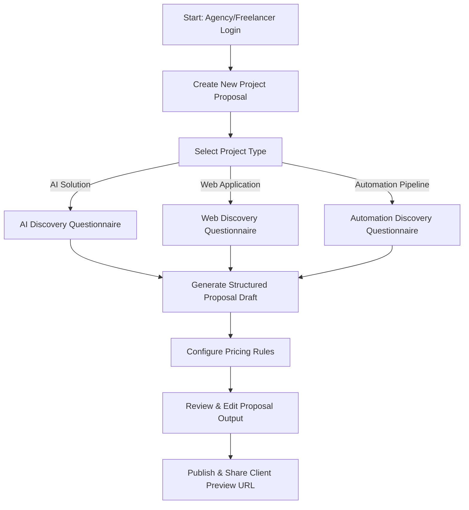

# FAPP User Flow

This document details the step-by-step user journey within the **FAPP SaaS MVP** framework.

---

## Detailed Step-by-Step Flow

### **Step 1: Selection**
* The user logs into the FAPP application dashboard.
* Click on **"Create New Proposal"**.
* The user is prompted to select the primary category of the project:
  * **AI Solution:** Machine learning models, LLM integrations, conversational agents.
  * **Web Application:** Business tools, portals, SaaS platforms, e-commerce.
  * **Automation Pipeline:** ETL pipelines, webhook connections, RPA, task automation.

### **Step 2: Guided Discovery Questions**
The user (or the agency on behalf of the client) answers a series of questions.
* **AI Track Questions:**
  1. *Goal:* What process is the AI automating or enhancing?
  2. *Data:* What source data is available (APIs, PDFs, databases)?
  3. *Interface:* How will users interact with the AI (chat, background API, web UI)?
* **Web Track Questions:**
  1. *Goal:* Who are the primary end users and what is their main action?
  2. *Integrations:* What external systems need to be connected (payment gateways, CRM)?
  3. *Core Features:* What are the absolute "must-have" interactions?
* **Automation Track Questions:**
  1. *Triggers:* What event starts the automation (email received, database update)?
  2. *Systems:* What are the source and target applications?
  3. *Volume:* How often does this run, and what volume of data is expected?

### **Step 3: Proposal Generation & Refinement**
* FAPP processes the discovery answers and maps them to a pre-defined proposal structure.
* The agency reviews the generated draft inside an interactive Markdown editor or rich form interface.
* Changes can be made to the project summary, recommended scope, risks, and next steps.

### **Step 4: Pricing & Package Configuration**
* The user inputs a baseline estimate or selects a preset size (Small, Medium, Large).
* The pricing engine automatically structures three packages:
  * **Essential:** Minimal viable scope, fastest delivery.
  * **Professional:** Fully featured recommended scope.
  * **Scale:** Premium features, scaling considerations, extended support.

### **Step 5: Share & Export**
* The user generates a public, read-only link of the proposal for the client.
* Alternatively, the user can copy the markdown or download the proposal to send via email.
